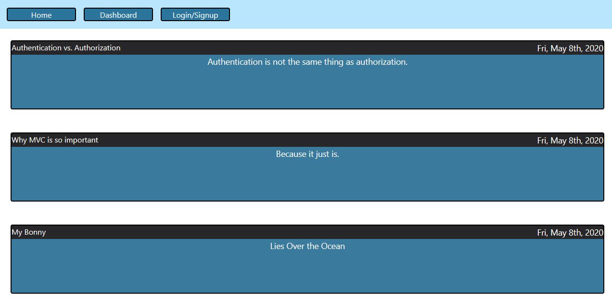
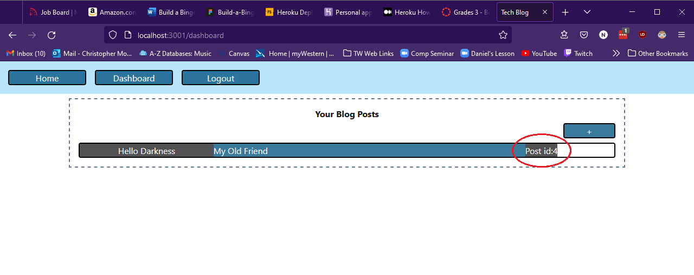
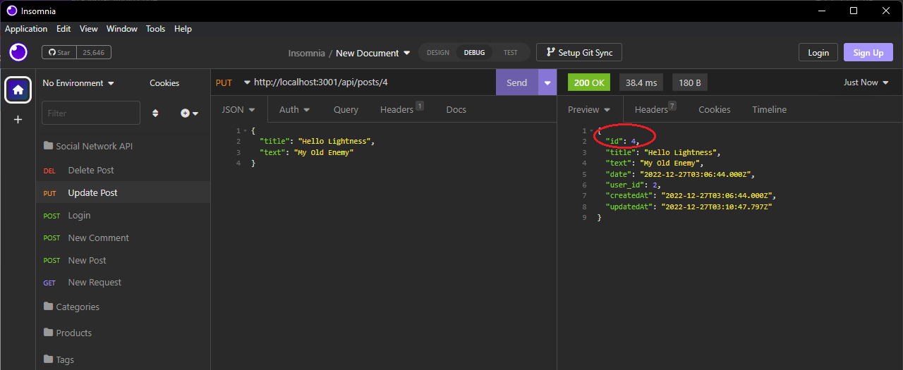

# tech-blog

The Tech Blog is a (mostly) working blog site. Users can create a new account, add blog posts with a title and text, view all of their own posts on their dashboard, and see all users' posts on the homepage. 

Currently, users cannot update or delete their own posts nor leave comments on other users' posts.

The site functions as normal via Heroku, with the exception that the database starts out unseeded. This means the homepage will not display any posts until a user creates a new account and makes a new post. When seeded, the homepage will look like this:

The function to update a user's own posts works on the back-end, but I have not been able to implement it on the front-end:

